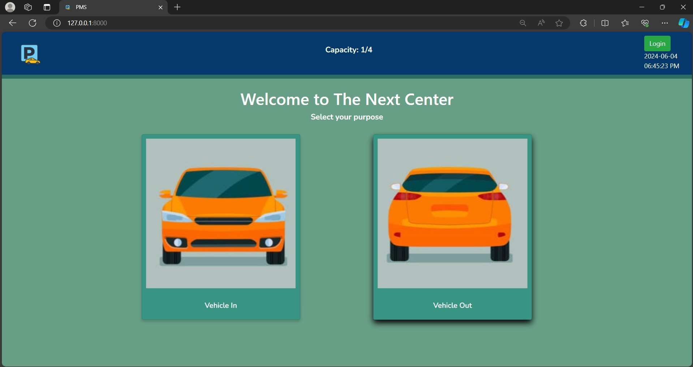
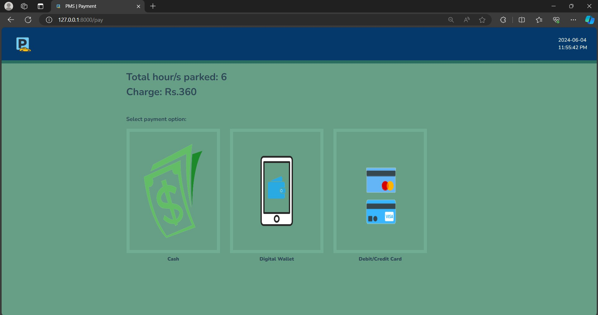
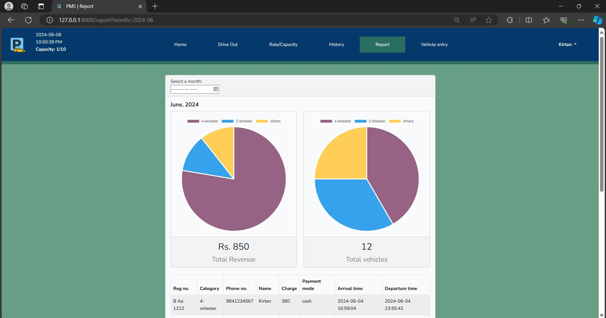
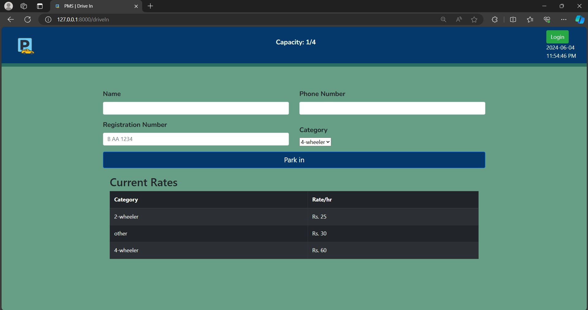

# Parking Management System for The Next Center

A Laravel-based Parking Management System developed as a summer project at **Thames International College**. This system is designed to streamline parking management at The Next Center by reducing congestion and improving operational efficiency.

## Table of Contents
- [Parking Management System for The Next Center](#parking-management-system-for-the-next-center)
  - [Table of Contents](#table-of-contents)
  - [Project Overview](#project-overview)
  - [Features](#features)
  - [Technologies Used](#technologies-used)
  - [Installation](#installation)
    - [Prerequisites](#prerequisites)
    - [Setup Steps](#setup-steps)
  - [Alternatively:](#alternatively)
    - [Usage](#usage)
    - [Testing](#testing)
    - [Limitations](#limitations)
    - [Future Enhancements](#future-enhancements)
    - [License](#license)
    - [Contact](#contact)

## Project Overview

The **Parking Management System (PMS)** was created to address parking challenges at The Next Center, a commercial complex that experiences high traffic. Developed as a summer project, this system provides a modern solution for tracking parking availability, managing parking entries and exits, and automating payment processing.

## Features

- **User Module**:
  - Real-time display of parking space availability
  - Streamlined entry and exit processes
  - 

- **Admin Module**:
  - Manage parking spot availability and monitor usage
  - Generate and view parking utilization reports
  - Set dynamic rates based on demand
  - 

- **Payment Integration**:
  - Integrated online payment processing for parking fees
  - 

## Technologies Used

- **Backend**: Laravel (PHP framework)
- **Frontend**: HTML, CSS, Bootstrap
- **Database**: MySQL (using XAMPP)
- **Tools and IDE**: Visual Studio Code
- **Browsers**: Google Chrome and Microsoft Edge for testing
- **Version Control**: Git and GitHub

## Installation

### Prerequisites
- [XAMPP](https://www.apachefriends.org/index.html) (for Apache and MySQL)
- [Composer](https://getcomposer.org/) (for Laravel dependencies)

### Setup Steps
1. **Install XAMPP and Start Services**:
   - Start Apache and MySQL services from the XAMPP Control Panel.
   - Open phpMyAdmin (usually at http://localhost/phpmyadmin) and create a database named "parking_management".
   - Alternatively, you can import the provided database file directly into phpMyAdmin.

2. **Clone the Repository**:
   ```bash
   git clone https://github.com/kirtanshrestha/parking-management-system.git
   cd parking-management-system
    ```
 3. **Install Dependencies**:
Run the following commands to install project dependencies:
```bash
composer install
npm install && npm run dev
```
 4. **Configure Environment Variables**:
- Copy `.env.example` to `.env`:
  ```bash
  cp .env.example .env

5. **Generate Application Key**:
Generate the application key by running the following command:
```bash
php artisan key:generate
```
6. **Run Migrations**:
If you're not using a provided database file, create the necessary tables by running:
```bash
php artisan migrate
```
 7. **Start the Application**:
Start the Laravel development server with:
```bash
php artisan serve
```
Access the application at [http://localhost:8000](http://localhost:8000).


## Alternatively: 
  This version includes an alternative step for importing the database directly. Let me know if you'd like further customization!


### Usage
- **Admin Dashboard**: Access the admin dashboard to manage parking spaces, monitor usage, and view reports.
    

- **User Module**: Users can find number of available parking spaces and complete parking-related transactions.
    

### Testing
The system has been tested for:
- **Functionality**: Core features like user login, parking availability tracking, and payment processing.
- **Performance**: Load testing to handle multiple users concurrently.
- **Security**: Basic testing for data integrity and input validation.

### Limitations
- Dependence on a stable internet connection for real-time data updates.
- High initial setup costs and dependency on XAMPP for local hosting.
- Limited scalability for larger parking lots or more complex systems.

### Future Enhancements
- **Smart Parking Sensors**: Integrating IoT sensors for real-time availability updates.
- **Advanced Analytics**: Data analysis for usage insights and dynamic rate optimization.
- **Automated License Plate Recognition (ALPR)**: To streamline vehicle entry and exit tracking.

### License
This project is licensed under the MIT License. See the [`LICENSE`](LICENSE) file for more details.

### Contact
Developed by Kirtan Shrestha   
[work.kirtanshrestha@gmail.com](mailto:work.kirtanshrestha@gmail.com)
