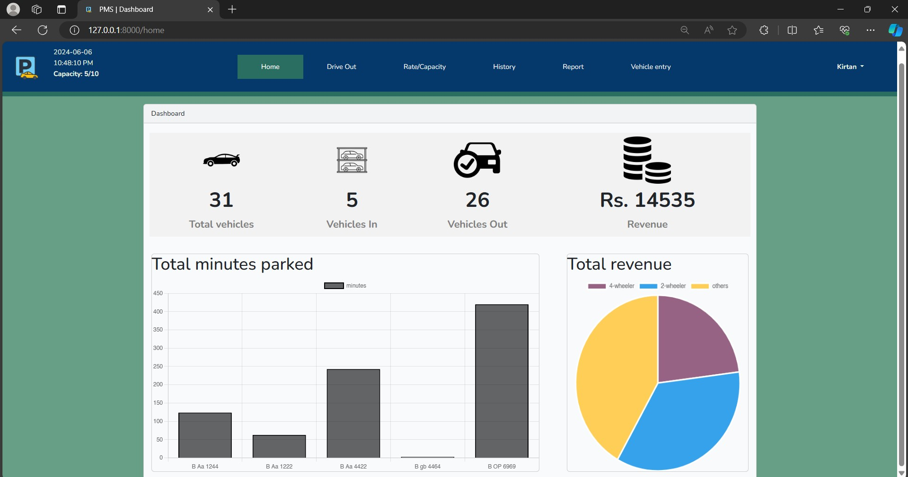

# Parking Management System for The Next Center

A Laravel-based Parking Management System developed as a summer project at **Thames International College**. This system is designed to streamline parking management at The Next Center by reducing congestion and improving operational efficiency.

## Table of Contents
- [Project Overview](#project-overview)
- [Features](#features)
- [Technologies Used](#technologies-used)
- [Installation](#installation)
- [Usage](#usage)
- [Testing](#testing)
- [Limitations](#limitations)
- [Future Enhancements](#future-enhancements)
- [License](#license)
- [Contact](#contact)

## Project Overview

The **Parking Management System (PMS)** was created to address parking challenges at The Next Center, a commercial complex that experiences high traffic. Developed as a summer project, this system provides a modern solution for tracking parking availability, managing parking entries and exits, and automating payment processing.

## Features

- **User Module**:
  - Real-time display of parking space availability
  - Streamlined entry and exit processes
  - 

- **Admin Module**:
  - Manage parking spot availability and monitor usage
  - Generate and view parking utilization reports
  - Set dynamic rates based on demand
  - 

- **Payment Integration**:
  - Integrated online payment processing for parking fees
  - 

## Technologies Used

- **Backend**: Laravel (PHP framework)
- **Frontend**: HTML, CSS, Bootstrap
- **Database**: MySQL (using XAMPP)
- **Tools and IDE**: Visual Studio Code
- **Browsers**: Google Chrome and Microsoft Edge for testing
- **Version Control**: Git and GitHub

## Installation

### Prerequisites
- [XAMPP](https://www.apachefriends.org/index.html) (for Apache and MySQL)
- [Composer](https://getcomposer.org/) (for Laravel dependencies)

### Setup Steps
1. **Install XAMPP and Start Services**:
   - Start Apache and MySQL services from the XAMPP Control Panel.
   - Open phpMyAdmin (usually at http://localhost/phpmyadmin) and create a database named "parking_management".
   - Alternatively, you can import the provided database file directly into phpMyAdmin.

2. **Clone the Repository**:
   ```bash
   git clone https://github.com/your-username/parking-management-system.git
   cd parking-management-system
